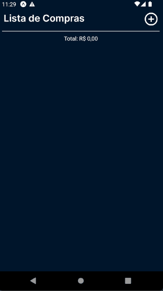

# 🛒 Lista de Compras - Aplicativo Mobile

Bem-vindo ao repositório oficial do **Lista de Compras**, um aplicativo projetado para tornar suas idas ao supermercado mais eficientes, organizadas e práticas.



---

## 📋 Funcionalidades Principais

O aplicativo oferece uma série de funcionalidades para facilitar sua experiência:

- **📑 Gerenciamento de Lista de Compras:** Crie, edite e remova itens da sua lista de forma simples e rápida.
- **🎨 Design Intuitivo:** Interface amigável e fácil de usar, proporcionando uma experiência agradável.
- **📤 Compartilhamento de Listas:** Compartilhe suas listas com familiares e amigos via WhatsApp.
- **💾 Persistência Local:** Suas listas são salvas localmente no dispositivo, sem necessidade de login.
- **🧮 Cálculo Automático de Totais:** O aplicativo calcula automaticamente o valor total da lista com base nos preços e quantidades dos itens.
- **💱 Suporte a Preços com Vírgulas:** Insira preços utilizando vírgulas ou pontos como separadores decimais.
- **✅ Marcar Itens Coletados:** Marque itens já coletados, facilitando o acompanhamento durante as compras.
- **💾 Salvar Itens com Preço Zerado:** Permita salvar itens mesmo que o preço esteja zerado.

---

## 🌟 Funcionalidades Planejadas

Estamos constantemente trabalhando para melhorar o aplicativo. Confira as funcionalidades que estão por vir:

- **⭐ Prioridade de Itens:** Marque itens como prioritários, destacando-os na interface.
- **🔔 Notificações:** Receba lembretes sobre itens que precisam ser comprados, utilizando a biblioteca `react-native-push-notification`.
- **📂 Múltiplas Listas:** Crie várias listas com títulos personalizados.
- **🧮 Calculadora de Mercado:** Calcule o preço por unidade (preço total dividido pela unidade, como litro ou kg).
- **💳 Contas a Pagar:** Gerencie uma lista de contas a pagar para controle financeiro.

---

## 🚀 Como Usar

Siga os passos abaixo para começar a usar o aplicativo:

1. **Baixe o APK mais recente:** [Clique aqui para baixar](https://github.com/StephHoel/lista-compras-mobile/releases/download/v1.3/lista-de-compras-v1.3.0.apk).
2. **Instale o aplicativo:** Após o download, instale o APK no seu dispositivo Android.
3. **Comece a usar:** Abra o aplicativo e comece a criar suas listas de compras. Não é necessário login.

---

## 🛠️ Como Fazer Build

Se você deseja compilar o aplicativo após realizar modificações, siga estas instruções:

1. **Configure os caminhos necessários no terminal Linux:**

   ```bash
   export JAVA_HOME=/usr/lib/jvm/java-17-openjdk-amd64
   export ANDROID_HOME=$HOME/android
   export ANDROID_SDK_ROOT=${ANDROID_HOME}
   export PATH=${ANDROID_HOME}/cmdline-tools/latest/bin:${ANDROID_HOME}/platform-tools:${ANDROID_HOME}/tools:${ANDROID_HOME}/tools/bin:${PATH}
   ```

2. **Execute o comando de build:**

   ```bash
   eas build --platform android --local
   ```

---

## 🤝 Como Contribuir

Contribuições são sempre bem-vindas! Você pode ajudar de várias formas:

- **📂 Abrir Issues:** Relate bugs ou sugira novas funcionalidades.
- **🔧 Enviar Pull Requests:** Contribua com correções de bugs, novas funcionalidades ou melhorias no código.

### Passos para Contribuir

1. Faça um fork do repositório.
2. Crie uma branch para sua funcionalidade ou correção: `git checkout -b minha-feature`.
3. Faça commit das suas alterações: `git commit -m 'Adiciona minha nova feature'`.
4. Envie para o repositório remoto: `git push origin minha-feature`.
5. Abra um Pull Request.

---

## 📄 Licença

Este projeto está licenciado sob a [MIT License](LICENSE). Sinta-se à vontade para usá-lo e modificá-lo conforme necessário.

---

## 📞 Suporte

Se você tiver dúvidas ou problemas, entre em contato abrindo uma [issue](https://github.com/StephHoel/lista-compras-mobile/issues).

---

## 🌟 Agradecimentos

Agradecemos a todos os contribuidores e usuários que ajudam a melhorar este projeto continuamente. Sua participação é essencial para o sucesso do **Lista de Compras**!
